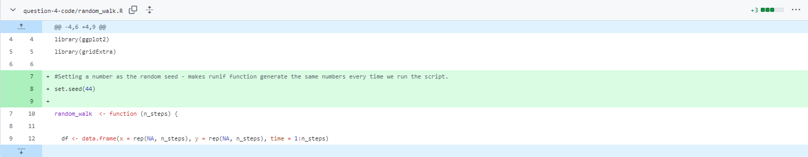

# Reproducible research: version control and R

## Questions 1, 2, and 3

My answers to these questions can be found in the README.md file [here](https://github.com/poetictable56/logistic_growth/tree/main).

## Question 4 
a) Every time you run the code you get two different random walks. In the plots, the darker blue is where they start the walk (at 0,0) and the lighter blue is where they end. The start point is fixed but end point is extremely variable. The axes are different, indicating that some walks will go much further in some directions than others. There is often a lot of going back on themselves and sometimes even travelling in a full loop, although sometimes (rarely) there is consistent travel in one direction.
  
b) A random seed is a number used to initialise a pseudorandom number generator (reference?) so that when you put the same seed into the generator you always get the same sequence of numbers output (so not a truly random output). This allows you to produce random patterns that are reproducible.

c/d) Here is the edit I made to include a random seed in the code, so that the runif() function always generates same random numbers for the random walk:

  
